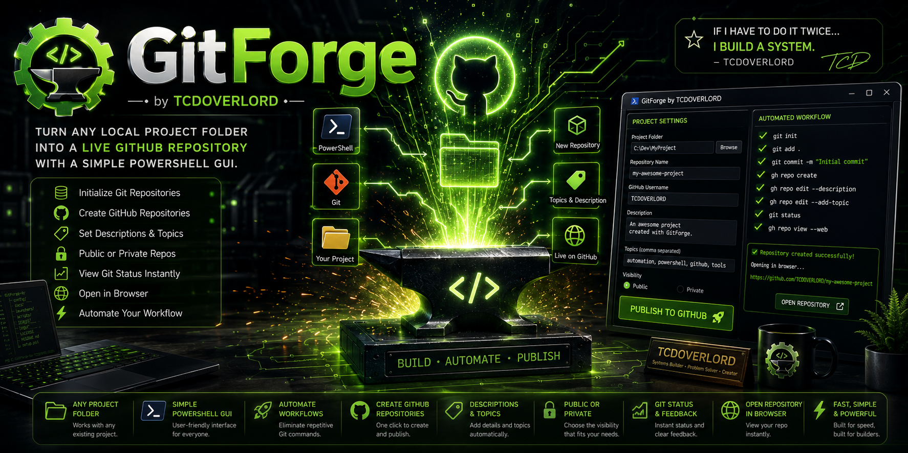
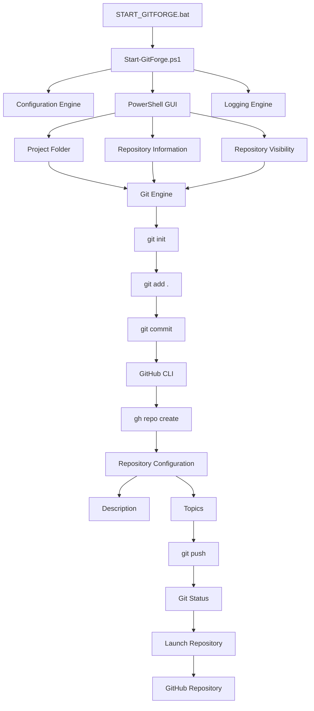

# ⚙️ GitForge by TCDOVERLORD

<p align="center">

</p>

<p align="center">


</p>

---

# 🚀 Overview

GitForge is a Windows PowerShell publishing assistant that transforms any local project folder into a fully initialized GitHub repository using an easy graphical interface.

Instead of repeatedly typing Git commands every time you create a project, GitForge automates the entire publishing workflow while still encouraging users to understand the Git process.

Developed by **TCDOVERLORD**

---

# ✨ Features

- 📂 Browse for any local project folder
- ⚙ Automatically initialize Git repositories
- 🌐 Create GitHub repositories
- 📝 Set repository descriptions
- 🏷 Add GitHub topics automatically
- 🔒 Choose Public or Private repositories
- 📊 Display Git status
- 🌍 Open the repository in your browser
- ⚡ Built entirely with PowerShell
- 🪶 Lightweight with no unnecessary dependencies

---

# 🔄 Automated Workflow

GitForge performs the complete publishing pipeline:

```powershell
git init
git add .
git commit
gh repo create
gh repo edit --description
gh repo edit --add-topic
git status
gh repo view --web
```

---

# 🖥 Requirements

- Windows 10 or Windows 11
- PowerShell 5.1 or newer
- Git
- GitHub CLI

Authenticate once using:

```powershell
gh auth login
```

---

# 🚀 Quick Start

Launch GitForge:

```text
launchers\START_GITFORGE.bat
```

Fill in:

- Project Folder
- Repository Name
- GitHub Username
- Description
- Topics
- Public or Private

Press:

```
Publish to GitHub
```

GitForge handles the rest.

---

# 📸 Interface

*(Screenshots coming soon)*

```
images/

├── GitForge_Hero.png
├── GitForge_Main_Window.png
├── GitForge_Repository_Created.png
└── GitForge_Workflow.png
```

---

# 📁 Project Structure

```text
GitForge-by-TCDOVERLORD/
│
├── config/
├── docs/
├── launchers/
├── logs/
├── scripts/
├── images/
│
├── LICENSE
├── README.md
└── setup.ps1
```

---

# 📚 Documentation

| Document | Description |
|----------|-------------|
| 📖 Philosophy | Project design principles |
| 🤖 AI Prompt Library | AI prompts for GitHub automation |
| 📘 Future Roadmap | Planned improvements |
| ⚙ Configuration Guide | Settings reference |

---

# 💡 Philosophy

GitForge exists because repetitive work should be automated.

The goal is not to hide Git—it is to eliminate repetitive setup so developers can spend more time building software.

> **If I have to do it twice... I build a system.**

— **TCDOVERLORD**

---

# 🛣 Roadmap

Future versions are planned to include:

- Repository templates
- Automatic README generation
- License selection
- GitHub Releases
- Changelog generation
- GitHub Actions support
- Repository health checks
- Batch publishing
- Project templates
- AI-assisted repository improvements

---

# 🏗️ Architecture



# 🤝 Contributing

Contributions are welcome.

Please review the documentation before opening a pull request.

Ideas, bug reports, and improvements are appreciated.

---

📄 License

This project is licensed under the **TCDOVERLORD Personal Learning License (TPLL) v1.0**.

This project is intended to support:

- 📚 Personal learning
- 🎓 Educational use
- 🧪 Research and experimentation
- 💻 Private, non-commercial projects

You are welcome to study, modify, and experiment with the source code for your own personal or educational purposes.

Commercial use—including resale, redistribution, business integration, SaaS offerings, consulting use, enterprise deployment, or inclusion in commercial products—is **not permitted** without prior written permission from the copyright owner.

For commercial licensing inquiries, please contact:

**TCDOVERLORD**

GitHub: https://github.com/tcdoverlord

See the [LICENSE](license) file for the complete license terms.

# 👨‍💻 Author

Developed by **TCDOVERLORD**

Building practical Windows tools that automate repetitive work, improve productivity, and make technology more accessible.

---

<p align="center">

⭐ If GitForge saved you time, consider starring the repository.

</p>
